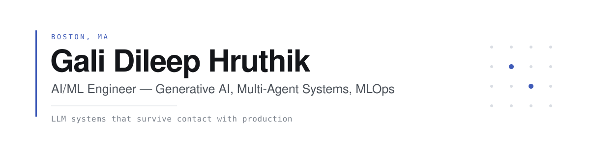

<picture>
  <source media="(prefers-color-scheme: dark)" srcset="./assets/banner-dark.svg">
  <source media="(prefers-color-scheme: light)" srcset="./assets/banner-light.svg">
  
</picture>

 

I build LLM systems that survive contact with production. Four years across fintech and enterprise AI — multi-agent orchestration, retrieval-augmented generation, document intelligence, and the evaluation and guardrail layers that make those systems trustworthy enough to deploy in regulated environments.

Currently an **AI Engineer at Cognizant**, building generative AI platforms on AWS for regulated banking and content operations. Previously **Machine Learning Engineer at Paytm**, owning credit risk, personalization, and support automation on a high-volume payments platform.

**Open to senior AI/ML engineering roles.**

 

 

## What I've shipped

**Document intelligence at scale.** OCR and extraction pipeline over 12,000 documents using Amazon Textract and Claude Sonnet via Bedrock, reaching 90% field-extraction accuracy. Confidence-based routing, PII masking, and human review let 72% of documents complete straight-through with no manual correction.

**Multi-agent regulatory content platform.** A LangGraph application spanning ingestion, retrieval, gap analysis, generation, compliance validation, and evaluation agents. Evaluator-optimizer loops scoring relevance, regulatory compliance, and evidence coverage raised first-pass approval from 61% to 82%, and cut drafting time from 35 minutes to 7 minutes per page.

**Credit risk and personalization.** Underwriting models supporting 50,000+ monthly loan applications with decision time halved, and a merchant cashback ranking engine that lifted click-through 8% during festive campaigns.

**Production reliability.** Drift and degradation monitoring across all deployed models, cutting undetected degradation incidents by 60%. EKS deployments with CodePipeline and automated rollback brought release time from 2 hours to 20 minutes.

 

## Selected projects

**[Bujji-Coder-AI](https://github.com/Hruthik07/Bujji-Coder-AI)** — Multi-agent coding assistant with AST-aware codebase understanding and persistent cross-session memory (SQLite + ChromaDB), routing intelligently across DeepSeek, Claude, and GPT.

**[llmforge-multimodal-transformer](https://github.com/Hruthik07/llmforge-multimodal-transformer)** — End-to-end platform for training and serving multimodal transformers. Custom Triton GPU kernels for RMSNorm deliver a 1.5–2x speedup, with dynamic batching and Prometheus metrics in the serving layer.

**[arxiv-paper-summarizer](https://github.com/Hruthik07/arxiv-paper-summarizer)** — LoRA fine-tune of Flan-T5-base on 31K arXiv papers, deployed as a SageMaker endpoint. 3.4x ROUGE-1 improvement over the base model.

**[SmartHire_AI](https://github.com/Hruthik07/SmartHire_AI)** — Resume analysis and job matching with LangChain and FAISS, wrapped in a full MLOps pipeline: DVC, MLflow, GitHub Actions.

**[hospital-readmission-mlops](https://github.com/Hruthik07/hospital-readmission-mlops)** — 30-day readmission risk classifier (XGBoost) with FastAPI serving, MLflow tracking, and automated CI/CD.

 

## Research

**Evaluating Agentic AI Systems** — independent research paper on evaluation methodology for multi-agent systems. [Read it →](https://drive.google.com/file/d/1x4lkLhmnGjeAZEFPVhw8hZ3OCH7c6Veq/view)

 

## Toolkit

**Agents & LLMs** · LangGraph · LangChain · CrewAI · MCP · Amazon Bedrock · Claude · agent evaluation & guardrails · prompt-injection controls · LoRA/QLoRA

**Retrieval** · Amazon OpenSearch · Titan Text Embeddings · Pinecone · Qdrant · FAISS · pgvector · hybrid search · cross-encoder reranking · RAGAS

**ML** · PyTorch · TensorFlow · scikit-learn · XGBoost · LightGBM · confidence calibration · drift detection

**Platform** · AWS (EKS, ECR, Bedrock, Textract, SageMaker, S3, SQS, KMS) · Docker · Kubernetes · Terraform · GitHub Actions

**Observability** · Langfuse · OpenTelemetry · MLflow · Weights & Biases · Prometheus · Grafana

 

## Education

**M.S. Data Science and Analytics** — New England College, Henniker, NH · June 2025

 

<picture>
  <source media="(prefers-color-scheme: dark)" srcset="https://github-readme-stats.vercel.app/api?username=Hruthik07&show_icons=true&hide_border=true&hide_title=true&bg_color=00000000&text_color=aeb7c2&icon_color=8fa6f5&hide=issues">
  
</picture>
<picture>
  <source media="(prefers-color-scheme: dark)" srcset="https://github-readme-stats.vercel.app/api/top-langs/?username=Hruthik07&layout=compact&hide_border=true&hide_title=true&bg_color=00000000&text_color=aeb7c2&langs_count=6">
  
</picture>

 

[LinkedIn](https://linkedin.com/in/hruthik07022001) · hruthikgd07jm@gmail.com
